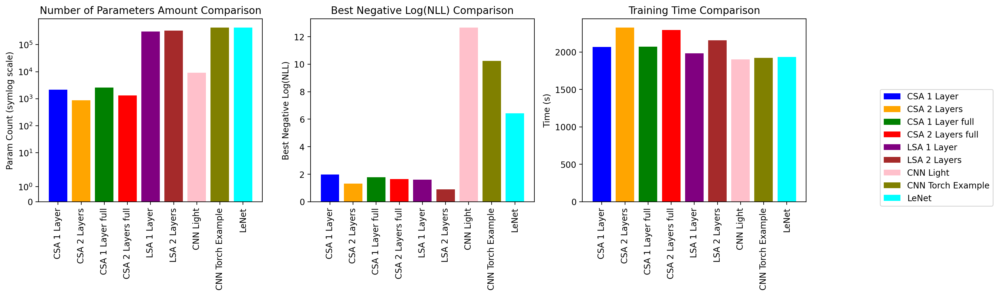

# Convolutional Self Attention
Adapted CSA from this NVIDIA Blog post: [here](https://developer.nvidia.com/blog/emulating-the-attention-mechanism-in-transformer-models-with-a-fully-convolutional-network/)

# Benchmarking
All models were run on T4 gpu instances in google colab.

The tests are done on the built-in torch MNIST dataset; with input sizes of 28x28. The tests are sorted into two categories:

- Classification of numbers
- Generation of images with classification as a secondary objective.

Included in each test is a video of the evolution of the Principle Component Analysis of the Latent Space of each model. These can only be viewed on google colab, however, and the larger classification script does not have the videos loaded due to render times. Clicking run all will generate the videos, and since random seeds are set in the training pipe, each latent space will not change (unless parameters are changed)

#TODO: Display comparison of generated numbers, as well as comparisons of per-class AUROC

# Results
##Classification Task
| Model Type       | MNIST NLL(train) | MNIST NLL(test) | MNIST Accuracy(train) | MNIST Accuracy(test) |
| ---------------- | ---------------- | --------------- | --------------------- | -------------------- |
|CSA 1 Layer       | 1.390e-1         | 1.443e-1        | 61.115                | 60.809               |
|CSA 2 Layers      | 2.686-1          | 2.472e-1        | 58.558                | 58.739               |
|CSA 1 Layer(Full) | 1.709e-1         | 1.769e-1        | 60.584                | 60.223               |
|CSA 2 Layers(Full)| 1.937e-1         | 1.712e-1        | 60.101                | 60.140               |
|LSA 1 Layer       | 1.999e-1         | 2.276e-1        | 60.261                | 59.528               |
|LSA 2 Layers      | 4.102e-1         | 4.127e-1        | 56.818                | 56.484               |
|Simple CNN        | **#2.369e-6#**     | 3.346e-2        | **63.931**            | 62.891               |
|torch example CNN | 3.808e-5         | 2.718e-2        | **63.931**            | 63.070               |
|LeNet             | 1.598e-3         | **2.489e-2**    | 63.909                | **63.140**           |

##Generative Task
#TODO: Add VAE Table Here

#TODO: Add VAE Bar Charts Here

# Replicating Results

#TODO: Add repeatable scripts; bench.py works, but needs more customizability.
